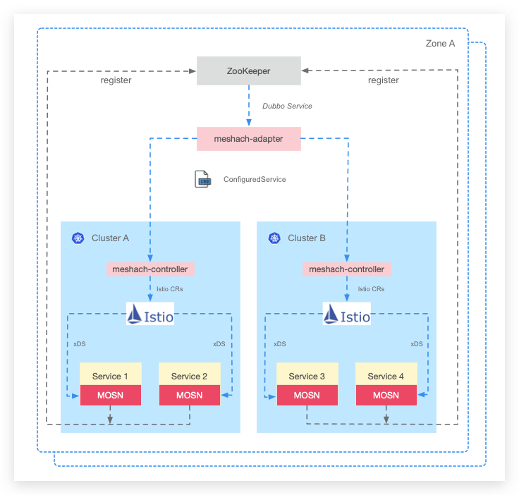

[](https://goreportcard.com/report/github.com/symcn/mesh-operator)
[](https://codecov.io/gh/symcn/mesh-operator)
[](https://github.com/symcn/mesh-operator/actions?query=workflow%3Ago-build)
[](https://github.com/symcn/mesh-operator/actions?query=workflow%3Apre-commit)
# mesh-operator
It is in charge of all things about implementation of Service Mesh.

What are our tasks?

1. Retrieving the data of service & instances from a registry center such as Nacos, zookeeper. 
2. Generating the istio's CRD through various data such as registry data & configurations.
3. Make MOSN be able to support serve a registry request which comes from a dubbo provider.



## Installing and running

### Build

Using Docker unified compilation(with version information):

```shell
$ make docker-build
```

Direct compilation:

```shell
$ CGO_ENABLED=0 GOOS=linux GOARCH=amd64 go build -v -o build/_output/bin/mesh-operator -ldflags "-s -w" cmd/mesh-operator/main.go
```

Build docker image and push:

```shell
$ make docker-push
```

You can customize the docker repository by modifying the `IMG_ADDR` variable in the [Makefile](./Makefile).

### Deploy

Install CRD:

```shell
$ cd deploy/crds
$ kubectl apply -f mesh.symcn.com_appmeshconfigs_crd.yaml -f mesh.symcn.com_istioconfigs_crd.yaml -f mesh.symcn.com_meshconfigs_crd.yaml -f mesh.symcn.com_configuredservices_crd.yaml
```

Install CRD no validations:
```shell
$ cd deploy/crds
$ kubectl apply -f simple_appmeshconfigs_crd.yaml -f simple_istioconfigs_crd.yaml -f simple_meshconfigs_crd.yaml -f simple_configuredservice_crd.yaml
```

Create ClusterRole, ClusterRoleBinding and ServiceAccount:
```shell
$ cd deploy
$ kubectl apply -f role.yaml -f role_binding.yaml -f service_account.yaml
```

Deploy adapter:
```shell
$ kubectl apply -f deploy/adapter.yaml
```

Deploy controller:
```shell
$ kubectl apply -f deploy/controller.yaml
```


## Getting support

- Some docs comming soon

## Features
Adapter:
- Synchronizing services from a specified registry center.
- Synchronizing the customized configuration of service from a specified config center
  
#### Source
The implementing for synchronizing services:
- Zookeeper servers of a dubbo cluster (Supported)
- Nacos (Planned)

The implementing for synchronizing configs:
- The configuration stored as a independent zNode for a dubbo service
- Nacos (Planned)

#### Target

The event handler what is used for creating or updating the services with its configuration
- Creating a CR named ConfiguredService correspond to a service into a single k8s cluster (Supported)
- Creating the CR into multiple k8s clusters (Supported)

### Supported

### Planned

